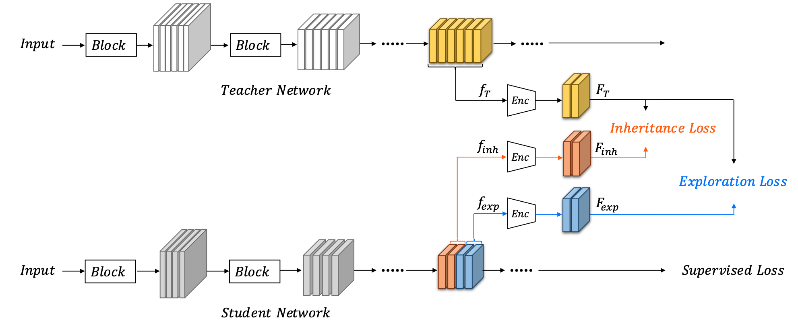

 # IE-KD
 This repository is the official implementation of:

 [**Revisiting Knowledge Distillation: An Inheritance and Exploration Framework**](https://arxiv.org/abs/2107.00181)

 Zhen Huang, Xu Shen, Jun Xing, Tongliang Liu, Xinmei Tian, Houqiang Li, Bing
 Deng, Jianqiang Huang, Xian-Sheng Hua

 *CVPR 2021*

 
 

 ### Overview

 The student network is split into two parts.
 
 One part (colored in orange) inherits the compact and effective representations encoded by factors from the teacher network via consistency/inheritance loss (similarity), and the other part (colored in blue) is pushed to generate different features via diversity/exploration loss (dis-similarity).
 
 The supervised task (classification/detection) loss guides the exploration part to converge to diverse yet effective features.

### Run environment

+ Python 3.7
+ Python bindings for OpenCV
+ Pytorch 1.1

### Usage
```
python main.py --config=configs/ie_kd.yaml
```

### License
+ Apache License 2.0


### Citation
If you use our code or models in your research, please cite with:
```
@inproceedings{huang2021revisiting,
  title={Revisiting Knowledge Distillation: An Inheritance and Exploration Framework},
  author={Huang, Zhen and Shen, Xu and Xing, Jun and Liu, Tongliang and Tian, Xinmei and Li, Houqiang and Deng, Bing and Huang, Jianqiang and Hua, Xian-Sheng},
  booktitle={CVPR},
  pages={3579--3588},
  year={2021}
}
```